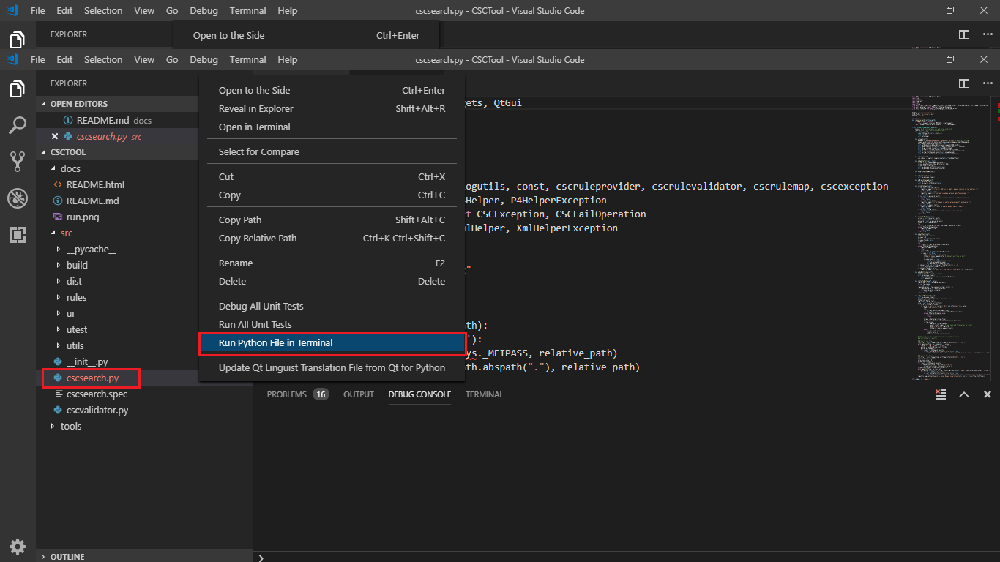

# 1. Developement enviroment
## Install python 3.6
- Link: <https://www.python.org/ftp/python/3.6.6/python-3.6.6-amd64.exe>

>NOTE:
- Select <b>`Add Python 3.6 to PATH`</b>
- Choose <b>`Customize installation`</b>
- Select <b>`Install for all user`</b>
- Install to <b>`C:\Python36`</b> directory, <u><b>NOT</u></b> `C:\Program Files\Python36`

## Install pip
- Go to <https://bootstrap.pypa.io/get-pip.py>
- Copy (Ctr + S) get-pip.py to G:\working\CSCTool
- From the command prompt, enter
    ```cmd
    cd G:\working\CSCTool
    G:
    ```
- Then enter 
    ```cmd
    python get-pip.py
    ```

## Install pip packages 
- After install pip completed, enter below command from command prompt (cmd)
   ```cmd
    pip install p4python
    pip install p4swamp
    pip install pyqt5
    pip install pyqt5-tools
   ```
- In case of installing errror, use easy_install below:
    ```cmd
    easy_install p4python
    easy_install p4swamp
    easy_install pyqt5
    easy_install pyqt5-tools
    easy_install pyqt5-sip
   ```
  
# 2. Optional tools

## Install QtCreator for creating Qt GUI
Link: <http://iso.mirrors.ustc.edu.cn/qtprojectarchive/online_installers/3.0qt-unified-windows-x86-3.0.5-online.exe>

## Install VS code IDE
Link: <https://code.visualstudio.com/download>

## Install P4V - P4 visual
Link: <https://cdist2.perforce.com/perforce/r18.4/bin.ntx64/p4vinst64.exe>

## Install P4 Server (to setup local server)
Link: <https://cdist2.perforce.com/perforce/r18.2/bin.ntx64/helix-core-server-x64.exe>


# 3. Build exe file 
- Install pyinstaller
    ```cmd
    pip install pyinstaller
    ```
- Download upx (optional - to compress file)
  + Link: <https://github.com/upx/upx/releases/tag/v3.95>
  + Usage: <https://pyinstaller.readthedocs.io/en/stable/usage.html>

- Build cscsearch
  + Go to folder contain cscsearch.py file 
  + Enter below cmd:
    + Without compress
    ```cmd
    pyinstaller --debug --clean --onefile --nowindowed --add-data "./ui/cscsearch.png;./ui" --add-data "./ui/cscsearch.ui;./ui" --add-data "./ui/cscsearchopenfiledialog.ui;./ui" cscsearch.py
    ```
    + With compress
    ```cmd
    pyinstaller --debug --clean --onefile --nowindowed --upx-dir G:\working\CSCTool\tools\upx-3.95-win64\upx-3.95-win64 --add-data "./ui/cscsearch.png;./ui" --add-data "./ui/cscsearch.ui;./ui" --add-data "./ui/cscsearchopenfiledialog.ui;./ui" cscsearch.py
    ```
- Build cscchangelistcreator
  + Go to folder contain cscchangelistcreator.py file 
  + Enter below cmd:
    + Without compress
    ```cmd
    pyinstaller --debug --clean --onefile --nowindowed --add-data "./ui/cscchangelistcreator.png;./ui" --add-data "./ui/cscchangelistcreator.ui;./ui" cscchangelistcreator.py
    ```
    + With compress
    ```cmd
    pyinstaller --debug --clean --onefile --nowindowed --upx-dir G:\working\CSCTool\tools\upx-3.95-win64\upx-3.95-win64 --add-data "./ui/cscchangelistcreator.png;./ui" --add-data "./ui/cscchangelistcreator.ui;./ui" cscchangelistcreator.py
    ```
- Build cscvalidator
  + Go to folder contain cscvalidator.py file 
  + Enter below cmd:
    + Without compress
    ```cmd
    pyinstaller --debug --clean --onefile --nowindowed --add-data "./ui/cscvalidator.png;./ui" --add-data "./ui/cscvalidator.ui;./ui" --add-data "./rules/condition.xml;./rules" --add-data "./rules/matching.xml;./rules" --add-data "./rules/measurement.xml;./rules" --add-data "./rules/parentchild.xml;./rules" --add-data "./rules/deprecated.xml;./rules" cscvalidator.py
    ```
    + With compress
    ```cmd
    pyinstaller --debug --clean --onefile --nowindowed --upx-dir G:\working\CSCTool\tools\upx-3.95-win64\upx-3.95-win64 --add-data "./ui/cscvalidator.png;./ui" --add-data "./ui/cscvalidator.ui;./ui" --add-data "./rules/condition.xml;./rules" --add-data "./rules/matching.xml;./rules" --add-data "./rules/measurement.xml;./rules" --add-data "./rules/parentchild.xml;./rules" --add-data "./rules/deprecated.xml;./rules" cscvalidator.py
    ```
# 4. Run & Debug
## Enable debug log
- Modify DEBUG value in logutils.py to TRUE

## How to run without building exe file
- cd to directory contain .py file
- Right click on .py file
- Select `Run Python file in Terminal`



# 5. Error handling
## Setup client workspace
In case of getting error 'Client `CLIENT_NAME` unknow', enter following cmds:
```cmd
p4 client -o CLIENT_NAME | p4 client -i
set P4CLIENT=
p4 set P4CLIENT=CLIENT_NAME
p4 info
```

## Change P4 server address and port
In case of getting error due to using old P4 server, enter following cmds.
- Replace serveraddr & port
```cmd
p4 set P4PORT=serveraddr:port
```
- Enter ```p4 info``` to verify

## Change P4 user
In case of getting error 'Access for user `USER`  has not been enabled by 'p4 protect':

```cmd
p4 set P4USER=USER
```
- Enter ```p4 info``` to verify